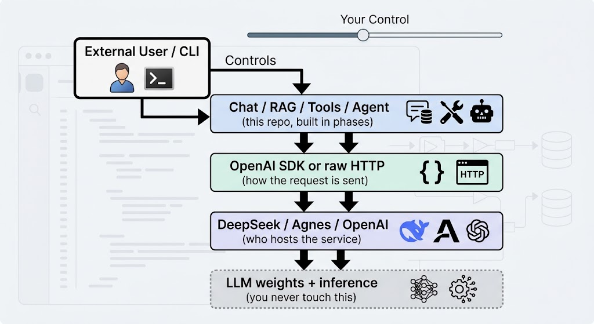
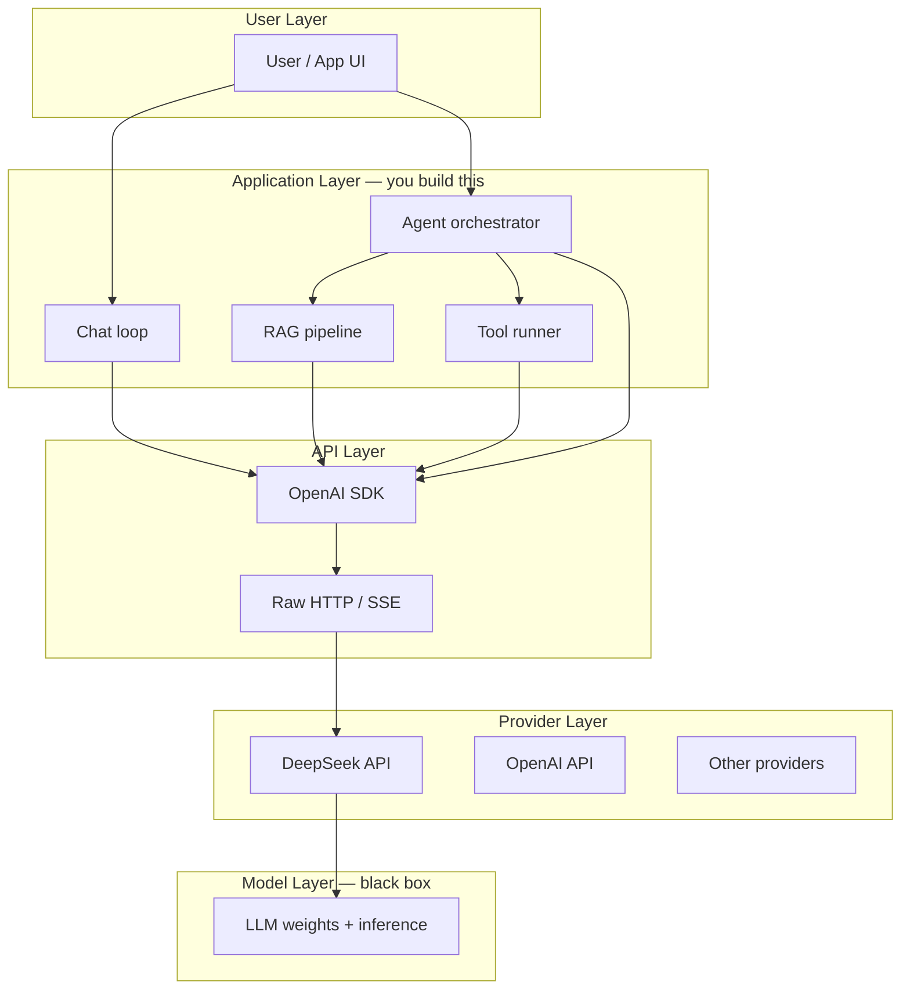
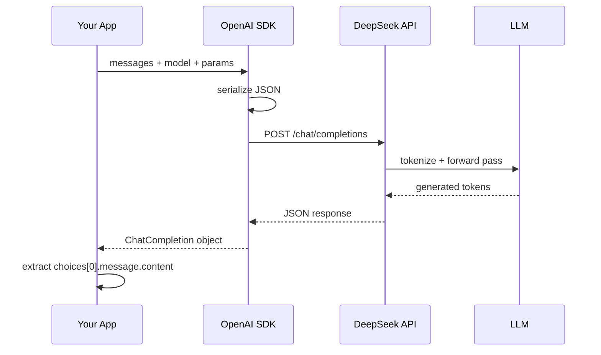
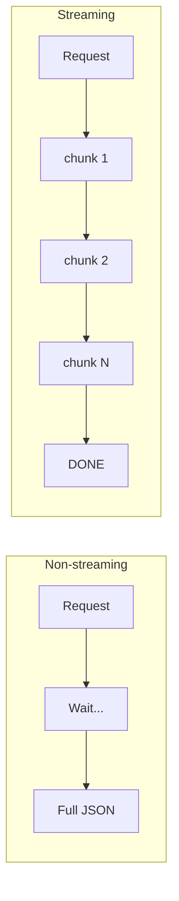
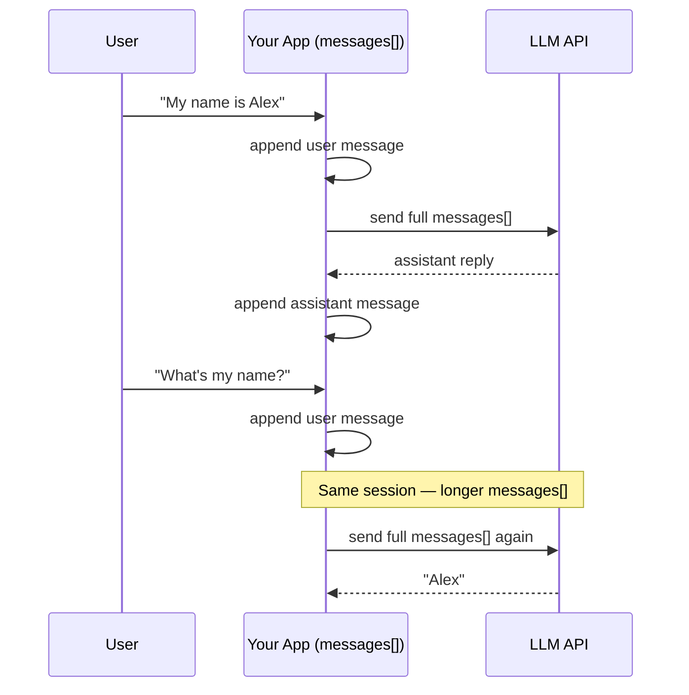
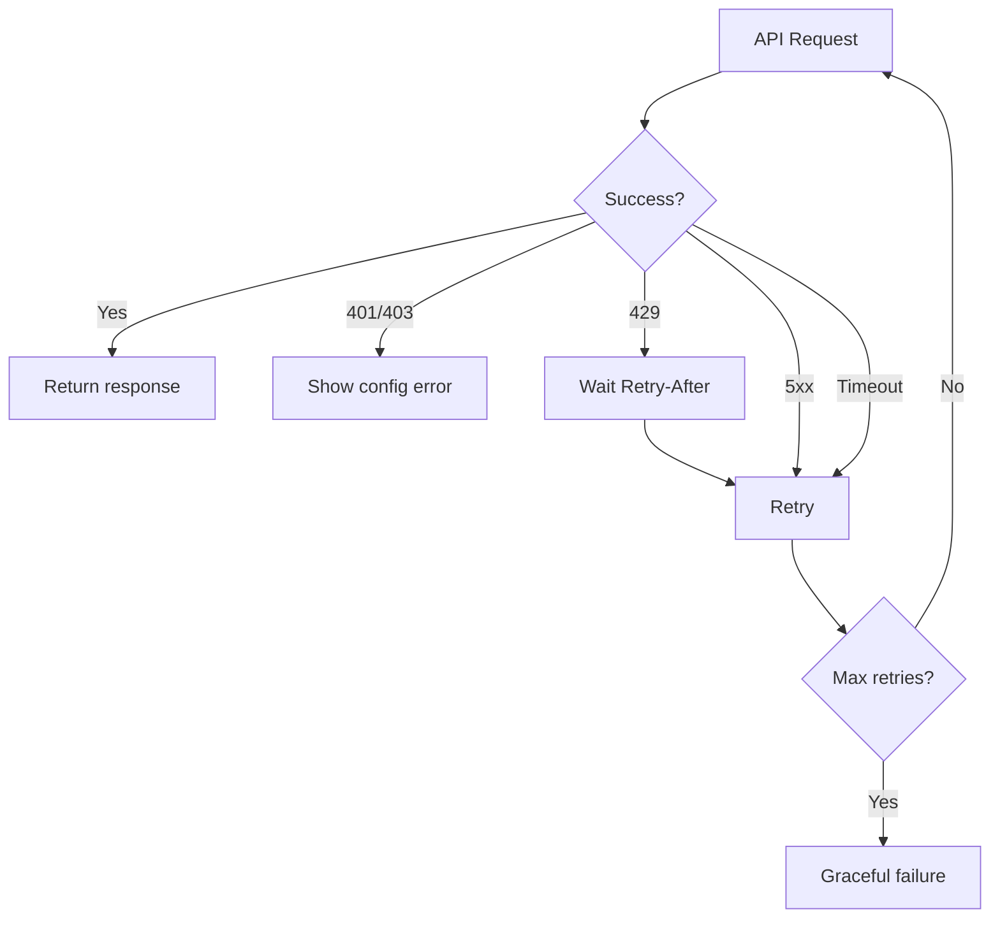
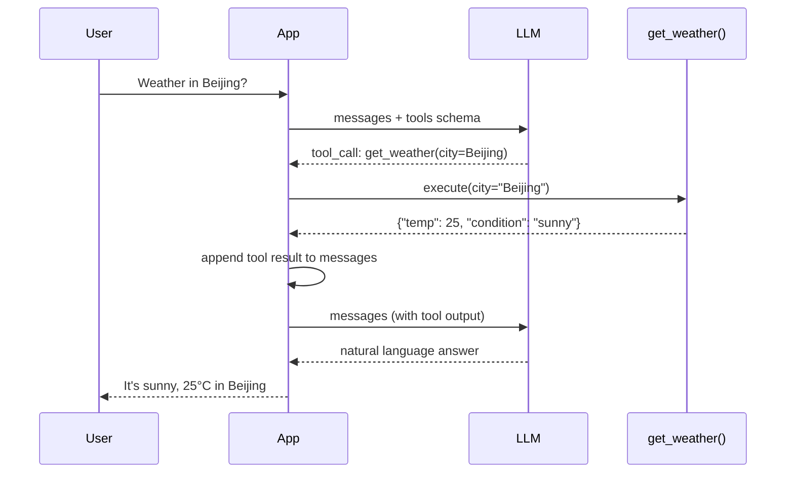
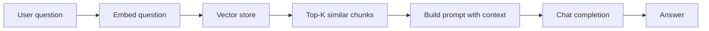
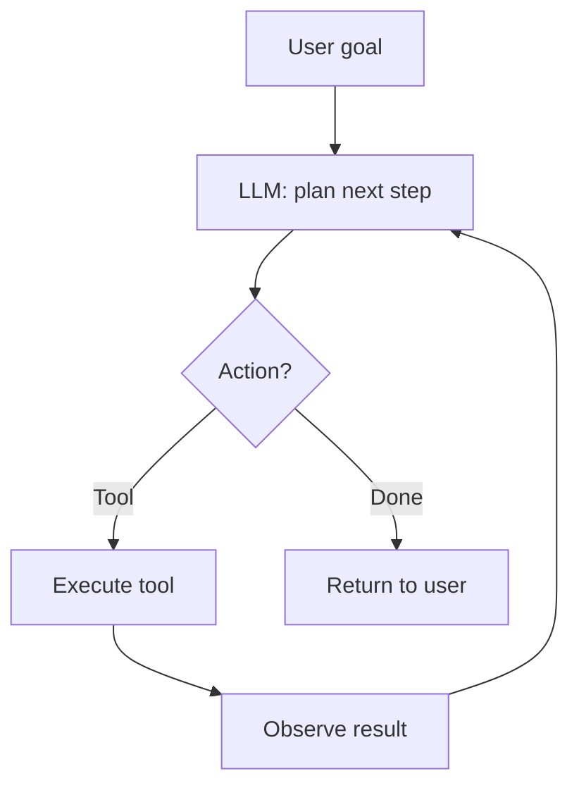

# llm-forge Learning Roadmap (Detailed)

A step-by-step map from **one HTTP call** to a full **LLM → RAG → Tool → Agent** mental model.

Use this doc as a notebook: each `📷 Image slot` is a place to paste a screenshot, diagram, or hand-drawn sketch.

---

## Part 0: The Big Picture — LLM Ecosystem

> Before touching code, understand where each piece lives in the stack.

### 0.1 Layered architecture

The point of this diagram is not “how many boxes exist”. It is a **control boundary**: you write the application; the model is a black box; they meet over HTTP.






**User layer.** A human types and reads. Today that is the terminal (`input("You: ")` in `chat/loop.py`). A web UI later should not force you to rewrite the layers below.

**Application layer — what this repo actually builds.** The four boxes are a **capability ladder**, not four side-by-side products:


| Box                | Now                            | Later                                                |
| ------------------ | ------------------------------ | ---------------------------------------------------- |
| Chat loop          | `chat/loop.py` + `ChatSession` | truncation, retries                                  |
| Tool runner        | not yet                        | model says “call this function”; your code runs it   |
| RAG pipeline       | not yet                        | retrieve doc chunks, then stuff them into `messages` |
| Agent orchestrator | not yet                        | Chat + Tools + RAG in a plan → act → observe loop    |


An agent is **not** a different API. It is an application-layer scheduler that repeatedly calls the same chat-completion endpoint.

**API layer — two paths for the same protocol.** The OpenAI SDK only serializes JSON, sends HTTP, and parses the response. This repo already has both paths:

- SDK: `api/request.py`, `api/stream.py`
- Raw HTTP: `native_http/`

`api/request.py` is conceptually one line: `client.chat.completions.create(...)`. Underneath it is still `POST /chat/completions`. Switching providers is usually `base_url` + `api_key`, not a new protocol.

**Provider vs model.** `provider.py` chooses **who** you call (URL + key: DeepSeek or Agnes). `model.py` chooses **which brain and knobs** (`agnes-2.0-flash`, `reasoning_effort`, thinking). Tokenize → forward pass → sampling all happen on the provider’s machines. You only see JSON in and JSON out. That is why the bottom layer is labeled **black box**.

**📷 Image slot 0.1-A** — Your own version of this stack diagram (label what you control vs what is external: `provider.py` / `model.py` / `api/` vs the hosted weights).

**📷 Image slot 0.1-B** — Screenshot of DeepSeek docs homepage / API reference (anchor: "this is the provider").

---


### 0.2 One request lifecycle (non-streaming)

Entry point: `main.py` — one question, wait for the full answer, print, exit.

```python
def main() -> None:
    client = custom_client()
    messages = default_messages()
    params = chat_params()
    response = create_chat_completion(client, messages, **params)
    print_response(response)
```




Walk the same call:

1. **Assemble three objects**
  - `client` — which host, which key (`provider.py`)
  - `messages` — what was said (`messages.py` / `ChatSession`)
  - `params` — which model, stream or not, thinking (`model.py`)
2. **SDK serializes** to JSON, e.g.
  ```json
   {
     "model": "agnes-2.0-flash",
     "stream": false,
     "messages": [
       {"role": "system", "content": "You are a helpful assistant"},
       {"role": "user", "content": "hello,Good Day!"}
     ]
   }
  ```
3. **HTTP** — `POST {base_url}/chat/completions` with `Authorization: Bearer ...`
4. **Provider (black box)** — tokenize → forward pass → sample tokens → join into a reply
5. **Response JSON** — the field you actually need:
  ```json
   {
     "choices": [
       {
         "message": {
           "role": "assistant",
           "content": "Hello! How can I help you today?"
         }
       }
     ]
   }
  ```
   `api/response.py` reads `choices[0].message.content`.
6. **App prints** — `print_response` dumps the text (and currently the whole `ChatCompletion` object, useful for matching this diagram).

Streaming (`main_stream.py`) shares steps 1–3. The difference is delivery: the server pushes `delta.content` over SSE; `iter_content` yields each slice; the terminal prints as tokens arrive. For the model it is still **one** completion.

**Key insight:** The model is **stateless**. The API does not remember the previous turn. Every call must resend the full `messages` list. Multi-turn chat is not “the model remembering you”; it is **your app accumulating history locally and resending it**. Kill the process or call `session.clear()` and the model has no past.

**📷 Image slot 0.2-A** — Sequence diagram (draw or export from Mermaid).

**📷 Image slot 0.2-B** — Raw JSON request body screenshot (from logs or DevTools).

**📷 Image slot 0.2-C** — Raw JSON response screenshot, with `choices[0].message.content` highlighted.

---


### 0.3 From Chat to Agent — capability ladder

Every rung still calls `chat.completions.create`. What changes is **what your app does before and after that call**.


| Stage              | What the system can do       | Memory                    | External world   | Your repo entry  |
| ------------------ | ---------------------------- | ------------------------- | ---------------- | ---------------- |
| 1. Basic call      | Single Q&A                   | None                      | No               | `main.py`        |
| 2. Streaming       | Same, but UX is live         | None                      | No               | `main_stream.py` |
| 3. Multi-turn chat | Context over turns           | `messages[]` you maintain | No               | `main_chat.py`   |
| 4. Robustness      | Survives errors / long chats | Same + truncation         | No               | *(planned)*      |
| 5. Tool calling    | Model triggers your code     | Same                      | Yes (functions)  | *(planned)*      |
| 6. RAG             | Answers from your docs       | Same + retrieved chunks   | Yes (vector DB)  | *(planned)*      |
| 7. Agent           | Plan → act → observe loop    | Same + tool results       | Yes (many tools) | *(planned)*      |


**Rungs 1–3 (already in this repo):**

- **1** — send two fixed messages, get one complete string, exit.
- **2** — same request with `stream=True`. Same completion, different UX.
- **3** — a loop that `add_user` / `add_assistant` and resends the **entire** history each turn.

That is the core of `chat/loop.py`:

```python
session.add_user(user_input)
reply = _stream_reply(client, session, params)
session.add_assistant(reply)
```

**Rungs 4–7 (what each one actually adds):**

- **4 Robustness** — networks fail; context windows overflow. Retry, timeout, truncate old turns by token count. Same memory shape, harder to kill.
- **5 Tool calling** — the model may return `tool_calls` instead of a final answer. You run the function, append `role: tool`, call the model again. First time the system can touch the real world.
- **6 RAG** — retrieve document chunks first, insert them into this turn’s `messages` (often as extra user/system text). The model still has no long-term memory; it just **sees more on this call**.
- **7 Agent** — not a new endpoint. An orchestrator loop: decide next step → call a tool or retrieve → observe → call the model again until it should stop. Chat, tools, and RAG are parts, not replacements.

When you draw Image slot 0.3-A, annotate **what each rung adds** (live tokens, history list, truncation, functions, retrieval, a scheduler). Do not draw four unrelated products.

**📷 Image slot 0.3-A** — Ladder diagram: Chat → Tools → RAG → Agent (annotate each rung).

---


### 0.4 Core data structure: `messages`

Every chat-style API call revolves around this list. The `role` values are part of the **protocol**, not Python syntax.

```json
[
  { "role": "system", "content": "You are a helpful assistant." },
  { "role": "user", "content": "What is 2+2?" },
  { "role": "assistant", "content": "4" },
  { "role": "user", "content": "What was my previous question?" }
]
```


| Role        | Purpose                              | Who writes it                 |
| ----------- | ------------------------------------ | ----------------------------- |
| `system`    | Behavior rules, persona, constraints | Your app (once per session)   |
| `user`      | Human input                          | User                          |
| `assistant` | Model output                         | Model (you store it)          |
| `tool`      | Function result (Phase 5+)           | Your app after running a tool |


**One-shot** (`messages.py`) is system + current user only — no history:

```python
def default_messages(user_content: str = "hello,Good Day!") -> list[dict[str, str]]:
    return [
        {"role": "system", "content": "You are a helpful assistant"},
        {"role": "user", "content": user_content},
    ]
```

**Multi-turn** (`ChatSession`) turns that list into session state: start with system, `add_user` / `add_assistant` each turn, `clear()` keeps only system.

How the array grows over three turns (Image slot 0.4-B):

```
Turn 1 send:  [system, user1]
Turn 1 store: [system, user1, assistant1]

Turn 2 send:  [system, user1, assistant1, user2]
Turn 2 store: [system, user1, assistant1, user2, assistant2]

Turn 3 send:  [system, user1, assistant1, user2, assistant2, user3]
```

If you forget `add_assistant` after turn 1, turn 2 the model cannot see what it just said — pronouns and follow-ups break. `/clear` is a new session, not a different model.

Later phases still use this array: RAG **inserts retrieved text** into this turn; tools append `assistant.tool_calls` plus `role: tool`. Same structure, more item kinds.

**📷 Image slot 0.4-A** — Table of roles with color coding (system=blue, user=green, assistant=gray).

**📷 Image slot 0.4-B** — Annotated `messages` array growing over 3 turns (Turn 1 → Turn 2 → Turn 3).

---


### 0.5 Repo map (current + planned)

The tree grows with the ladder. Files are split by concern so later phases do not tangle into one script.

```
llm-forge/
├── provider.py          # Who to call (URL + key)           ← provider layer config
├── messages.py          # Default messages list             ← 0.4 one-shot version
├── model.py             # Model name + sampling / thinking  ← knobs
├── api/                 # SDK path
│   ├── request.py       # Non-streaming Phase 1
│   ├── response.py      # Extract content
│   └── stream.py        # Streaming Phase 2
├── native_http/         # Same protocol, no SDK
├── chat/                # Multi-turn Phase 3
│   ├── session.py       # Owns messages[]
│   └── loop.py          # Read input → call API → append history
├── utils/               # Retry / truncation Phase 4 — planned
├── tools/               # Function calling Phase 5 — planned
├── rag/                 # Embeddings + retrieval Phase 6 — planned
└── agent/               # Orchestrator loop Phase 7 — planned
```

Three entry points map to rungs 1–3:

- `main.py` — one full response
- `main_stream.py` — one streamed response
- `main_chat.py` — session loop (uses streaming internally)

`main_native.py` / `main_native_stream.py` prove the same lifecycle without the SDK.

**One line through the whole picture:**

1. User speaks → append `{"role":"user", ...}` to `messages`.
2. App sends system + history + model params via SDK or raw HTTP.
3. Model is stateless; it only sees **this** list. Reply arrives whole or as deltas.
4. App takes `content` (or a tool call), stores `assistant`, waits for the next turn.
5. Retrieval, functions, and the agent loop all insert logic between steps 1 and 4. The underlying call is still one chat completion.

Phases 1–7 fill this map. They do not replace it.

**📷 Image slot 0.5-A** — Folder tree screenshot from your IDE.

---


## Phase 1: Basic Calls — Send a message, get a reply

> **Goal:** Close the smallest possible loop: input → API → output.
> **Agent relevance:** Every agent step ends with a chat completion call.

**Status:** ✅ Done

---


### Step 1.1 Separate concerns in code ✅

**Why split files?** Later phases add tools, RAG, and agents. Clean boundaries prevent spaghetti.


| Module            | Responsibility         | Analogy           |
| ----------------- | ---------------------- | ----------------- |
| `provider.py`     | Who to call (URL, key) | Phone dial config |
| `messages.py`     | What to say            | Script / dialogue |
| `model.py`        | Which brain + knobs    | Model settings    |
| `api/request.py`  | Send request           | Press "send"      |
| `api/response.py` | Parse reply            | Read inbox        |


- [x] Split `provider`
- [x] Split `messages`
- [x] Split `model`
- [x] Split `api/request` + `api/response`

**📷 Image slot 1.1-A** — Module dependency diagram (arrows: `main → api → provider`).

**📷 Image slot 1.1-B** — Side-by-side: monolithic `model.py` vs split modules.

**Files:** `provider.py`, `messages.py`, `model.py`, `api/request.py`, `api/response.py`, `main.py`

**Verify:**

```bash
export DEEPSEEK_API_KEY=your_key
python main.py
```

---


### Step 1.2 OpenAI SDK — the shortcut layer ✅

**What the SDK hides:**

1. Python dict → JSON string
2. HTTP POST with headers
3. Wait for response
4. JSON → typed Python object (`ChatCompletion`)

```python
# What you write
client.chat.completions.create(model="...", messages=[...])

# What happens under the hood (conceptually)
POST /chat/completions + Authorization + JSON body → parse response
```

- [x] Configure `OpenAI(api_key=..., base_url="https://api.deepseek.com")`
- [x] Call `chat.completions.create()`
- [x] Read `response.choices[0].message.content`

**📷 Image slot 1.2-A** — SDK call in IDE with breakpoint before/after.

**📷 Image slot 1.2-B** — `ChatCompletion` object expanded in debugger (show `choices`, `usage`, etc.).

**Deep dive: OpenAI-compatible providers**


| Field      | DeepSeek                   | OpenAI                      |
| ---------- | -------------------------- | --------------------------- |
| `base_url` | `https://api.deepseek.com` | `https://api.openai.com/v1` |
| Endpoint   | `/chat/completions`        | `/chat/completions`         |
| Auth       | `Bearer <key>`             | `Bearer <key>`              |
| Body shape | Same                       | Same                        |


**📷 Image slot 1.2-C** — Provider comparison table (your notes).

---


### Step 1.3 Native HTTP — see the wire format ✅

**Why bother if SDK exists?** Agents, streaming, and debugging all make more sense when you've seen raw HTTP.

**Request (conceptual):**

```http
POST https://api.deepseek.com/chat/completions
Authorization: Bearer sk-...
Content-Type: application/json

{
  "model": "deepseek-v4-flash",
  "messages": [
    {"role": "system", "content": "You are a helpful assistant"},
    {"role": "user", "content": "hello"}
  ],
  "stream": false,
  "reasoning_effort": "high",
  "thinking": {"type": "enabled"}
}
```

**Response (conceptual):**

```json
{
  "id": "chatcmpl-...",
  "object": "chat.completion",
  "choices": [
    {
      "index": 0,
      "message": {
        "role": "assistant",
        "content": "Hello! How can I help you today?"
      },
      "finish_reason": "stop"
    }
  ],
  "usage": {
    "prompt_tokens": 20,
    "completion_tokens": 12,
    "total_tokens": 32
  }
}
```

- [x] Build JSON body manually
- [x] Set `Authorization` and `Content-Type` headers
- [x] Parse response JSON and extract content

**📷 Image slot 1.3-A** — HTTP request in a REST client (Postman / Insomnia / curl output).

**📷 Image slot 1.3-B** — Full response JSON with `choices[0].message.content` circled.

**📷 Image slot 1.3-C** — Side-by-side: SDK 5 lines vs native HTTP 30 lines.

**Files:** `native_http/request.py`, `native_http/response.py`, `main_native.py`

**Verify:**

```bash
python main_native.py
```

---


### Step 1.4 Phase 1 checklist — mental model quiz

Before moving on, you should be able to answer:

- [ ] What three headers/body fields are required for a chat call?
- [ ] Where does the assistant's text live in the response JSON?
- [ ] Why does DeepSeek work with the `openai` Python package?
- [ ] What is the difference between your code and the model weights?

**📷 Image slot 1.4-A** — Your handwritten answers or flashcard screenshot.

---


## Phase 2: Streaming — Generate and display incrementally

> **Goal:** Understand incremental delivery at both HTTP and application layers.
> **Agent relevance:** Agents stream thoughts + tool calls to UI; users see progress in real time.

**Status:** ✅ Done

---


### Step 2.1 Non-streaming vs streaming — two paradigms ✅


|                | Non-streaming          | Streaming                        |
| -------------- | ---------------------- | -------------------------------- |
| `stream` param | `false`                | `true`                           |
| HTTP body      | One JSON at end        | SSE stream (`text/event-stream`) |
| Client reads   | `response.json()` once | Loop: read chunk → chunk → …     |
| UX             | Wait → full text       | Typewriter effect                |
| Use case       | Batch, short replies   | Chat UI, long generation         |





**📷 Image slot 2.1-A** — Terminal: `main.py` (pause then dump) vs `main_stream.py` (live output).

**📷 Image slot 2.1-B** — Timeline diagram: server generating token-by-token.

---


### Step 2.2 SDK streaming — iterate chunks ✅

**Application-layer concept:** Each chunk carries a **delta** (increment), not the full text.

```python
for chunk in stream:
    delta = chunk.choices[0].delta.content  # e.g. "Hel", then "lo"
    if delta:
        print(delta, end="", flush=True)
```

- [x] Pass `stream=True` (via merged params)
- [x] Iterate the stream object
- [x] Accumulate deltas if you need the full reply later

**📷 Image slot 2.2-A** — Print each chunk with `repr()` to see increments.

**📷 Image slot 2.2-B** — Diagram: `delta="Hel"` + `delta="lo"` → `"Hello"`.

**Files:** `api/stream.py`, `main_stream.py`

---


### Step 2.3 Native HTTP streaming — SSE protocol ✅

**SSE (Server-Sent Events)** — server pushes lines over one long-lived HTTP response:

```
data: {"choices":[{"delta":{"content":"Hi"}}]}

data: {"choices":[{"delta":{"content":" there"}}]}

data: [DONE]
```

**Parsing rules:**

1. Read line by line from the socket
2. Ignore empty lines
3. Lines starting with `data:`  contain payload
4. `data: [DONE]` means stop
5. Otherwise JSON-parse the payload and read `choices[0].delta.content`

- [x] Set `Accept: text/event-stream`
- [x] Set `stream: true` in JSON body
- [x] Parse SSE lines manually

**📷 Image slot 2.3-A** — Raw SSE stream captured in terminal (`curl -N` output).

**📷 Image slot 2.3-B** — Annotated SSE line: prefix `data:`  vs JSON payload vs `[DONE]`.

**Files:** `native_http/stream.py`, `main_native_stream.py`

---


### Step 2.4 Phase 2 checklist

- [ ] Can you explain "read slices" at HTTP layer vs "read deltas" at app layer?
- [ ] Why is `flush=True` needed for typewriter UX?
- [ ] What happens if you forget to handle `[DONE]`?

**📷 Image slot 2.4-A** — Your notes comparing chunk, delta, and token.

---


## Phase 3: Multi-turn Chat — Conversation memory

> **Goal:** Maintain `messages` across turns so the model has context.
> **Agent relevance:** Agent memory is the same list, plus tool messages and summaries.

**Status:** ✅ Done (SDK path); optional native path pending

---


### Step 3.1 Stateless model, stateful application ✅




**Critical rule:** The API does not remember Turn 1 when you send Turn 2. **You** resend everything.

- [x] Keep a persistent `messages` list in memory
- [x] Append user input before each call
- [x] Append assistant output after each call

**📷 Image slot 3.1-A** — `messages` array growing: after turn 1, turn 2, turn 3.

**📷 Image slot 3.1-B** — Network tab showing request body size increasing each turn.

---


### Step 3.2 Session abstraction ✅

`ChatSession` encapsulates:

- `system` prompt (always first)
- `add_user()` / `add_assistant()`
- `clear()` → reset to system-only

```python
session = ChatSession()
session.add_user("My name is Alex")
# ... API call ...
session.add_assistant("Hi Alex!")
session.add_user("What's my name?")
# messages now has 4 items (system + 3)
```

- [x] Implement `chat/session.py`
- [x] Expose `messages` property for API calls

**📷 Image slot 3.2-A** — Class diagram: `ChatSession` methods and internal `_messages`.

---


### Step 3.3 Interactive loop + streaming reply ✅

**Loop logic:**

```
while True:
    read user input
    if exit → break
    if /clear → reset session
    append user message
    stream assistant reply
    append full assistant text to session
```

- [x] `input()` loop
- [x] Stream while collecting full reply for history
- [x] Commands: `exit`, `quit`, `/clear`

**📷 Image slot 3.3-A** — Terminal screenshot of multi-turn name memory test.

**📷 Image slot 3.3-B** — Flowchart of `chat/loop.py`.

**Files:** `chat/session.py`, `chat/loop.py`, `main_chat.py`

**Verify:**

```bash
python main_chat.py
```

---


### Step 3.4 Optional: native HTTP chat ⬜

- [ ] Reuse `ChatSession` + `chat/loop.py` with `native_http/stream`
- [ ] Compare: only the transport layer changes, session logic stays identical

**📷 Image slot 3.4-A** — Venn diagram: shared session logic vs swapped HTTP layer.

**Planned file:** `main_native_chat.py`

---


### Step 3.5 Phase 3 checklist

- [ ] Why must assistant replies be appended to `messages`?
- [ ] What breaks if you only send the latest user message?
- [ ] Where would you persist history for tomorrow's session? (preview: Phase 4+ / DB)

---


## Phase 4: Robustness — Production-ready calls

> **Goal:** Handle failure, limits, and context overflow.
> **Agent relevance:** Agents make many chained calls; one 429 should not crash the loop.

**Status:** ✅ Done

---


### Step 4.1 HTTP errors — know the failure modes


| Code    | Name                  | Cause                | Your action        |
| ------- | --------------------- | -------------------- | ------------------ |
| 401     | Unauthorized          | Bad/missing API key  | Fix env, fail fast |
| 403     | Forbidden             | Key lacks permission | Check account      |
| 429     | Too Many Requests     | Rate limit           | Backoff + retry    |
| 500     | Internal Server Error | Provider issue       | Retry with limit   |
| 503     | Service Unavailable   | Overloaded           | Retry + jitter     |
| Timeout | —                     | Network / slow model | Retry or abort     |





- [x] Wrap API calls in try/except
- [x] Map status codes to user-facing messages
- [x] Log error body for debugging

**📷 Image slot 4.1-A** — Screenshot of a 429 response body / headers.

**📷 Image slot 4.1-B** — Decision tree diagram for error handling.

**Planned files:** `utils/errors.py`, integrate into `api/request.py` and `chat/loop.py`

---


### Step 4.2 Retry with exponential backoff

**Pattern:**

```
wait 1s → retry → fail → wait 2s → retry → fail → wait 4s → ...
```

- [x] Configurable max retries (e.g. 3)
- [x] Exponential backoff + random jitter
- [x] Respect `Retry-After` on 429

**📷 Image slot 4.2-A** — Graph: retry attempt vs wait time.

**📷 Image slot 4.2-B** — Code snippet screenshot with `@with_retry` decorator.

**Planned file:** `utils/retry.py`

---


### Step 4.3 Tokens and context window

**Token** ≈ piece of text (roughly 4 chars in English, varies by language).

**Context window** = max tokens per request (input + output combined).

```
┌─────────────────────────────────────────────┐
│           Context window (e.g. 64K)         │
│  ┌──────────────┐ ┌──────────────────────┐  │
│  │ Input tokens │ │ Output tokens        │  │
│  │ (messages)   │ │ (model generation)   │  │
│  └──────────────┘ └──────────────────────┘  │
└─────────────────────────────────────────────┘
```

- [ ] Count tokens with `tiktoken` (or provider tokenizer)
- [ ] Detect when `messages` exceed budget
- [x] Truncate: keep `system` + last N turns
- [ ] Optional: summarize old turns instead of dropping

**Truncation strategies:**


| Strategy                      | Pros               | Cons                     |
| ----------------------------- | ------------------ | ------------------------ |
| Drop oldest turns             | Simple             | Loses early context      |
| Sliding window (last N turns) | Predictable        | May drop important facts |
| Summarize old turns           | Keeps gist         | Extra API call           |
| RAG over chat log             | Searchable history | More infra               |


**📷 Image slot 4.3-A** — Diagram: context window filling up over long chat.

**📷 Image slot 4.3-B** — Before/after truncation: 20 messages → 6 messages.

**Planned files:** `chat/token_counter.py`, `chat/truncate.py`

**Dependency:** `pip install tiktoken`

---


### Step 4.4 Phase 4 deliverables

- [x] Chat survives a temporary 429
- [x] Chat survives 100+ turns without context error
- [x] Clear error message when API key is missing

**📷 Image slot 4.4-A** — Demo: intentionally bad key → friendly error.

---


## Phase 5: Tool Calling — Model meets the outside world

> **Goal:** Model outputs structured "call this function" instead of only text.
> **Agent relevance:** Tools are the **hands** of an agent. No tools = no actions.

**Status:** ✅ Done

---


### Step 5.1 What is a tool?

A **tool** = function schema you describe to the model + function you implement in code.

```json
{
  "type": "function",
  "function": {
    "name": "get_weather",
    "description": "Get current weather for a city",
    "parameters": {
      "type": "object",
      "properties": {
        "city": { "type": "string", "description": "City name" }
      },
      "required": ["city"]
    }
  }
}
```

**📷 Image slot 5.1-A** — Tool schema annotated: name, description, parameters.

**📷 Image slot 5.1-B** — Analogy diagram: model = brain, tools = hands, your runner = nervous system.

---


### Step 5.2 Tool calling flow (single tool)




**New message types:**

```json
{"role": "assistant", "tool_calls": [{"id": "call_abc", "function": {"name": "get_weather", "arguments": "{\"city\":\"Beijing\"}"}}]}
{"role": "tool", "tool_call_id": "call_abc", "content": "{\"temp\": 25, \"condition\": \"sunny\"}"}
```

- [x] Define tool schema in Python
- [x] Pass `tools=[...]` in API request
- [x] Detect `finish_reason == "tool_calls"`
- [x] Parse `tool_calls[0].function.name` and `.arguments`
- [x] Execute local function
- [x] Append `tool` message with result
- [x] Call model again for final answer

**📷 Image slot 5.2-A** — Full message list after tool round-trip (4+ messages).

**📷 Image slot 5.2-B** — Sequence diagram screenshot (your draw.io / Excalidraw).

**Planned files:** `tools/schema.py`, `tools/weather.py`, `tools/runner.py`, `main_tools.py`

---


### Step 5.3 Multiple tools — model chooses

- [x] Register `get_weather`, `calculator`, `search_web`
- [x] Model picks based on description quality
- [x] Handle direct text answer (no tool needed)

**📷 Image slot 5.3-A** — Routing diagram: user question → which tool?

**Tip:** Tool **descriptions** are prompt engineering. Vague descriptions → wrong tool choice.

---


### Step 5.4 Tool calling vs traditional code


| Traditional                            | Tool calling               |
| -------------------------------------- | -------------------------- |
| `if "weather" in input: get_weather()` | Model decides when to call |
| Fixed routing rules                    | Flexible natural language  |
| Brittle keyword matching               | Handles paraphrasing       |


**📷 Image slot 5.4-A** — Comparison table in your notes.

---


### Step 5.5 Phase 5 checklist

- [ ] Can you trace a tool call through the full `messages` array?
- [ ] Why is a second API call needed after tool execution?
- [ ] What happens if your function throws an exception?

---


## Phase 6: RAG — Retrieval-Augmented Generation

> **Goal:** Answer from **your documents**, not just training data.
> **Agent relevance:** RAG is how agents read manuals, codebases, and KB articles.

**Status:** ⬜ Not started

---


### Step 6.1 The knowledge problem

**Without RAG:**

- Model only knows training cutoff data
- Cannot read your PDFs / wiki / private DB

**With RAG:**

- Retrieve relevant chunks at query time
- Inject chunks into prompt → model answers with context

**📷 Image slot 6.1-A** — Meme-style diagram: "Model without RAG" vs "Model with RAG reading docs".

---


### Step 6.2 Embeddings — text to vectors

**Embedding** = dense numeric vector representing meaning.

```
"dog"  → [0.12, -0.34, 0.56, ...]   # 1536 dims example
"puppy"→ [0.11, -0.31, 0.58, ...]   # close in space
"car"  → [-0.45, 0.22, -0.19, ...]  # far away
```

Similar meaning → small distance (cosine / L2).

- [ ] Call embedding API
- [ ] Store `(chunk_text, vector)` pairs
- [ ] Visualize 2D projection (optional, for intuition)

**📷 Image slot 6.2-A** — 2D scatter plot: dog/puppy close, car far (from notebook or screenshot).

**📷 Image slot 6.2-B** — Embedding API request/response JSON.

**Planned file:** `rag/embed.py`

---


### Step 6.3 Chunking — split documents

Long docs don't fit in context. Split into chunks:

```
Document (5000 words)
  → Chunk 1 (500 tokens)
  → Chunk 2 (500 tokens)
  → ...
```


| Parameter  | Tradeoff                              |
| ---------- | ------------------------------------- |
| Chunk size | Larger = more context, fewer chunks   |
| Overlap    | Reduces boundary cutting mid-sentence |
| Splitter   | By paragraph vs fixed token window    |


- [ ] Load raw text / markdown
- [ ] Split with overlap
- [ ] Attach metadata (source file, page)

**📷 Image slot 6.3-A** — Document with chunk boundaries highlighted.

**Planned file:** `rag/chunk.py`

---


### Step 6.4 Vector store — remember embeddings

Simple → advanced:


| Store               | Complexity | Use when             |
| ------------------- | ---------- | -------------------- |
| JSON file           | Low        | Learning / prototype |
| SQLite + numpy      | Medium     | Small datasets       |
| Chroma / FAISS      | Medium     | Local apps           |
| Pinecone / Weaviate | High       | Production scale     |


- [ ] Embed all chunks
- [ ] Save to store with IDs
- [ ] Load store on startup

**📷 Image slot 6.4-A** — Vector store schema diagram (id, text, vector, metadata).

**Planned file:** `rag/store.py`

---


### Step 6.5 Retrieval — find relevant chunks




**Similarity:** cosine similarity between query vector and chunk vectors.

- [ ] Embed user query
- [ ] Compute similarity vs all chunks
- [ ] Take top-K (e.g. K=3)
- [ ] Build prompt:

```
Use the following context to answer:

[Chunk 1 text]
[Chunk 2 text]

Question: {user_question}
```

**📷 Image slot 6.5-A** — Top-K retrieval diagram with scores (0.89, 0.85, 0.72).

**📷 Image slot 6.5-B** — Final prompt with injected context (screenshot).

**Planned files:** `rag/retrieve.py`, `main_rag.py`

---


### Step 6.6 RAG failure modes (important)


| Problem       | Symptom                 | Mitigation                      |
| ------------- | ----------------------- | ------------------------------- |
| Bad chunks    | Wrong context retrieved | Better splitting / overlap      |
| Missing info  | "I don't know"          | Expand corpus                   |
| Hallucination | Answer not in chunks    | Cite sources, lower temperature |
| Stale data    | Old info                | Re-index pipeline               |


**📷 Image slot 6.6-A** — Your notes on a RAG failure you observed.

---


## Phase 7: Agents — Orchestration and autonomy

> **Goal:** Multi-step reasoning: plan → act → observe → repeat.
> **This is where Phases 3–6 compose into one system.**

**Status:** ⬜ Not started

---


### Step 7.1 What is an Agent?

**Simple chat:** 1 user message → 1 model call → 1 reply

**Agent:**

```
goal → think → (optional) call tool → observe result → think again → ... → final answer
```




**📷 Image slot 7.1-A** — Agent loop diagram (classic ReAct: Reason + Act).

**📷 Image slot 7.1-B** — Real product screenshot: Cursor / ChatGPT with tools enabled.

---


### Step 7.2 Agent = Chat + Tools + Loop + Guardrails


| Component        | From phase | Role in agent     |
| ---------------- | ---------- | ----------------- |
| `messages[]`     | Phase 3    | Short-term memory |
| Streaming        | Phase 2    | UX for long runs  |
| Retry / truncate | Phase 4    | Stability         |
| Tool calling     | Phase 5    | Actions           |
| RAG              | Phase 6    | Knowledge         |


**📷 Image slot 7.2-A** — Composition diagram: building blocks stacking into "Agent".

---


### Step 7.3 ReAct pattern (Reason + Act)

**Example trace:**

```
Thought: User wants weather in Beijing. I should call get_weather.
Action: get_weather(city="Beijing")
Observation: {"temp": 25, "condition": "sunny"}
Thought: I have enough info to answer.
Answer: It's sunny in Beijing, 25°C.
```

- [ ] System prompt instructs think → act → observe format
- [ ] Parse model output for action decisions
- [ ] Or use native `tool_calls` (modern approach)

**📷 Image slot 7.3-A** — ReAct trace in terminal log.

**Planned file:** `agent/prompts.py`

---


### Step 7.4 Agent loop implementation

```python
MAX_STEPS = 10
for step in range(MAX_STEPS):
    response = call_llm(messages, tools=tools)
    if response.has_tool_calls:
        result = run_tools(response.tool_calls)
        messages.append(tool_results)
        continue
    else:
        return response.content  # done
raise MaxStepsExceeded()
```

- [ ] Step limit (prevent infinite loops)
- [ ] Timeout per run
- [ ] Log each step for debugging

**📷 Image slot 7.4-A** — Flowchart of agent loop with MAX_STEPS exit.

**Planned files:** `agent/loop.py`, `main_agent.py`

---


### Step 7.5 Agent memory types (ecosystem view)


| Memory    | Duration        | Implementation        |
| --------- | --------------- | --------------------- |
| Working   | Current run     | `messages[]`          |
| Session   | Until cleared   | `ChatSession` / Redis |
| Long-term | Cross-session   | Vector DB + RAG       |
| Episodic  | Past agent runs | Log + retrieval       |


**📷 Image slot 7.5-A** — Memory pyramid diagram.

---


### Step 7.6 Multi-agent (preview — beyond this repo)

Not required for llm-forge v1, but know the landscape:


| Pattern  | Description                        |
| -------- | ---------------------------------- |
| Router   | One agent delegates to specialists |
| Pipeline | Agent A → Agent B → Agent C        |
| Debate   | Agents critique each other         |


**📷 Image slot 7.6-A** — Multi-agent architecture from a blog or paper screenshot.

---


## Phase 8: Async and scale (optional advanced)

> **Goal:** Concurrent requests for throughput.
> **Agent relevance:** Parallel tool calls, batch embedding for RAG index.

**Status:** ⬜ Not started

---


### Step 8.1 Sync vs async


| Sync                       | Async                |
| -------------------------- | -------------------- |
| One call blocks until done | Many calls in flight |
| Simple mental model        | Needs `asyncio`      |
| Fine for CLI chat          | Better for servers   |


- [ ] `AsyncOpenAI` client
- [ ] `asyncio.gather()` for parallel calls
- [ ] Async streaming

**📷 Image slot 8.1-A** — Timeline: 3 sequential calls vs 3 parallel calls.

**Planned files:** `api/async_request.py`, `main_async.py`

---


## Appendix A: Image index (for your notebook)

Use this checklist to track which visuals you've created:


| Slot ID | Topic                         | Done |
| ------- | ----------------------------- | ---- |
| 0.1-A   | Layered architecture          | ⬜    |
| 0.1-B   | Provider docs screenshot      | ⬜    |
| 0.2-A   | Request lifecycle sequence    | ⬜    |
| 0.2-B   | Request JSON                  | ⬜    |
| 0.2-C   | Response JSON                 | ⬜    |
| 0.3-A   | Capability ladder             | ⬜    |
| 0.4-A   | Message roles table           | ⬜    |
| 0.4-B   | Messages growth over turns    | ⬜    |
| 0.5-A   | Repo folder tree              | ⬜    |
| 1.1-A   | Module diagram                | ⬜    |
| 1.3-A   | Raw HTTP in REST client       | ⬜    |
| 2.1-A   | Stream vs non-stream terminal | ⬜    |
| 2.3-A   | Raw SSE output                | ⬜    |
| 3.1-A   | Messages array growth         | ⬜    |
| 3.3-A   | Multi-turn terminal demo      | ⬜    |
| 4.3-A   | Context window filling        | ⬜    |
| 5.2-A   | Tool call message list        | ⬜    |
| 6.2-A   | Embedding similarity plot     | ⬜    |
| 6.5-A   | RAG retrieval top-K           | ⬜    |
| 7.1-A   | Agent loop diagram            | ⬜    |
| 7.2-A   | Agent composition stack       | ⬜    |


---


## Appendix B: Glossary


| Term                        | One-line definition                             |
| --------------------------- | ----------------------------------------------- |
| **LLM**                     | Large language model; predicts next tokens      |
| **Token**                   | Text unit the model reads/writes                |
| **Prompt**                  | Input you send (often `messages`)               |
| **Completion**              | Model-generated output                          |
| **Context window**          | Max tokens per request                          |
| **Streaming**               | Incremental output delivery                     |
| **SSE**                     | Server-Sent Events HTTP format                  |
| **Tool / Function calling** | Model requests external function execution      |
| **Embedding**               | Numeric vector representing text meaning        |
| **RAG**                     | Retrieve docs → inject into prompt → generate   |
| **Agent**                   | LLM loop that plans and uses tools autonomously |
| **ReAct**                   | Reason + Act agent pattern                      |


**📷 Image slot B-A** — Your personal glossary flashcards.

---


## Appendix C: Current progress


| Phase             | Status     | Entry files                               | Image slots to fill |
| ----------------- | ---------- | ----------------------------------------- | ------------------- |
| 0 Big picture     | 📖 Study   | —                                         | 0.1 – 0.5           |
| 1 Basic calls     | ✅ Done     | `main.py`, `main_native.py`               | 1.1 – 1.4           |
| 2 Streaming       | ✅ Done     | `main_stream.py`, `main_native_stream.py` | 2.1 – 2.4           |
| 3 Multi-turn chat | ✅ Done     | `main_chat.py`                            | 3.1 – 3.5           |
| 4 Robustness      | ✅ Done     | `utils/errors.py`, `utils/retry.py`, `chat/truncate.py` | 4.1 – 4.4 |
| 5 Tool calling    | ✅ Done     | `tools/schema.py`, `tools/runner.py`, `main_tools.py`   | 5.1 – 5.5 |
| 6 RAG             | ⬜          | —                                         | 6.1 – 6.6           |
| 7 Agents          | ⬜          | —                                         | 7.1 – 7.6           |
| 8 Async           | ⬜ Optional | —                                         | 8.1                 |


---


## Appendix D: Suggested folder for your images

```
llm-forge/
└── docs/
    └── images/
        ├── 00-ecosystem/
        ├── 01-basic-calls/
        ├── 02-streaming/
        ├── 03-multi-turn/
        ├── 04-robustness/
        ├── 05-tools/
        ├── 06-rag/
        └── 07-agents/
```

After adding an image, link it in this file:

```markdown

```

---


## Next action

1. **Study Part 0** — fill image slots 0.1–0.5 while re-running `main.py` and `main_native.py`
2. **Say "next"** — start Phase 4 implementation (errors, retry, token truncation)

