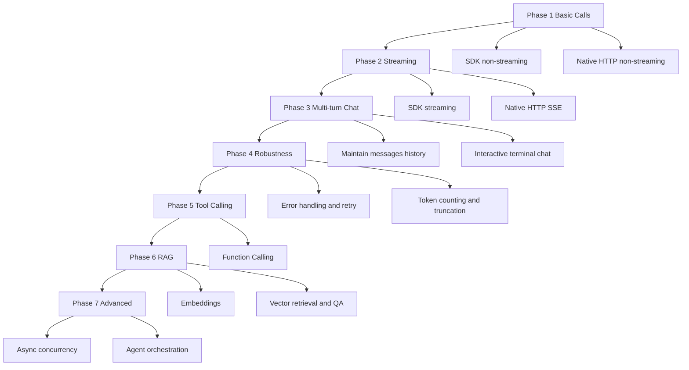

# llm-forge Learning Roadmap

Build a mental model of LLM APIs from scratch, and leave runnable code in this repo at every step.

---

## Overview



---

## Phase 1: Basic Calls — Send a message, get a reply

> Goal: Understand the minimal LLM API loop, and the difference between the SDK and raw HTTP.

### Step 1.1 Project structure and concern separation ✅

- [x] Split out `provider` (client config)
- [x] Split out `messages` (conversation messages)
- [x] Split out `model` (model name and params)
- [x] Split out `api/request` + `api/response` (request and response)

**Core concepts**

| Concept | Description |
|---------|-------------|
| `provider` | Who serves the API (DeepSeek), via `base_url` + `api_key` |
| `messages` | Conversation content; each item has `role` (system / user / assistant) and `content` |
| `model` | Which model to use, plus params like `reasoning_effort` and `thinking` |
| `response` | API response shape; the reply text lives in `choices[0].message.content` |

**Files**

- `provider.py` / `messages.py` / `model.py`
- `api/request.py` / `api/response.py`
- `main.py`

**Verify**

```bash
export DEEPSEEK_API_KEY=your_key
python main.py
# Should print the model reply
```

---

### Step 1.2 OpenAI SDK call ✅

- [x] Use the `openai` package with `base_url` pointed at DeepSeek
- [x] Call `client.chat.completions.create()`

**What to understand**

- The SDK handles JSON serialization, HTTP, response parsing, and Python object wrapping
- DeepSeek is OpenAI-compatible, so the same SDK works with a different `base_url`

**Files**

- `provider.py` → `get_client()`
- `api/request.py` → `create_chat_completion()`

---

### Step 1.3 Native HTTP call ✅

- [x] Send POST manually with stdlib `urllib`
- [x] Build the JSON body, set headers, and parse the JSON response yourself

**What to understand**

Under the hood, the SDK is basically doing this:

```http
POST https://api.deepseek.com/chat/completions
Authorization: Bearer <API_KEY>
Content-Type: application/json

{"model":"...", "messages":[...], ...}
```

**Files**

- `native_http/request.py` → `create_chat_completion()`
- `native_http/response.py` → `get_content()`
- `main_native.py`

**Verify**

```bash
python main_native.py
# Output should match main.py
```

---

## Phase 2: Streaming — Generate and display incrementally

> Goal: Understand how streaming works, and the difference between SDK iteration and SSE.

### Step 2.1 SDK streaming ✅

- [x] Set `stream=True`
- [x] Iterate chunks and read `delta.content`
- [x] Use `print(..., end="", flush=True)` for a typewriter effect

**What to understand**

- Non-streaming: wait until generation finishes → return one full JSON payload
- Streaming: push partial output as it is generated → client reads chunks in a loop
- Each chunk's `delta.content` is an **increment**, not the full text so far

**Files**

- `api/stream.py`
- `main_stream.py`

**Verify**

```bash
python main_stream.py
# Text should appear character by character
```

---

### Step 2.2 Native HTTP streaming (SSE) ✅

- [x] Response type is `text/event-stream`
- [x] Read line by line in `data: {...}` format
- [x] Stop when you see `data: [DONE]`

**What to understand**

SSE (Server-Sent Events) looks like this:

```
data: {"choices":[{"delta":{"content":"Hi"}}]}

data: {"choices":[{"delta":{"content":" there"}}]}

data: [DONE]
```

**Files**

- `native_http/stream.py`
- `main_native_stream.py`

**Verify**

```bash
python main_native_stream.py
# Behavior should match main_stream.py
```

---

## Phase 3: Multi-turn Chat — Give the model conversation memory

> Goal: Maintain a `messages` list and build an interactive terminal chat loop.

### Step 3.1 Understand messages history

- [x] Send the full conversation history on every request
- [x] Append each new user message to the list
- [x] Append the assistant reply back into the list too

**What to understand**

The model has no memory by itself; every request is stateless. "Memory" means you resend the prior `messages` each time.

```python
messages = [
    {"role": "system", "content": "You are a helpful assistant"},
    {"role": "user", "content": "My name is Alex"},
    {"role": "assistant", "content": "Hi Alex!"},
    {"role": "user", "content": "What's my name?"},  # Model can answer "Alex"
]
```

**Planned files**

- `chat/session.py` → add/remove messages in the conversation list
- `chat/loop.py` → read user input, call the API, update history

---

### Step 3.2 Interactive terminal chat

- [x] Loop on user input with `input()`
- [x] Stream the assistant reply
- [x] Support an exit command (`exit` / `quit`)
- [x] Optional: a clear-history command (`/clear`)

**Planned files**

- `main_chat.py` → entry point for the interactive loop

**Verify**

```bash
python main_chat.py
> My name is Alex
# Model responds
> What's my name?
# Model should answer "Alex"
> exit
```

---

### Step 3.3 Native HTTP multi-turn chat (optional)

- [ ] Implement the same interactive flow with `native_http`
- [ ] Compare code differences against the SDK version

**Planned files**

- `main_native_chat.py`

---

## Phase 4: Robustness — Production essentials

> Goal: Handle failures, rate limits, and oversized context safely.

### Step 4.1 Error handling

- [ ] Catch HTTP errors (401, 429, 500)
- [ ] Catch network timeouts
- [ ] Show user-friendly error messages

**What to understand**

| Status | Meaning | Typical handling |
|--------|---------|------------------|
| 401 | Invalid API key | Check env vars |
| 429 | Rate limited | Wait and retry |
| 500 | Server error | Retry or degrade gracefully |

**Planned files**

- `api/errors.py` or `utils/retry.py`

---

### Step 4.2 Retry logic

- [ ] Retry automatically after failure with exponential backoff
- [ ] Set a max retry count
- [ ] On 429, respect the `Retry-After` header when present

**Planned files**

- `utils/retry.py` → `with_retry()` decorator or wrapper

---

### Step 4.3 Token counting and context truncation

- [ ] Learn the model context window (e.g. 64K tokens)
- [ ] Estimate total tokens in `messages`
- [ ] Truncate old turns when over the limit (keep system + last N turns)

**What to understand**

- Input and output share the same context window
- Too much history → API error or silent truncation
- Common strategies: sliding window, summarization

**Planned files**

- `chat/token_counter.py` → estimate token usage
- `chat/truncate.py` → truncation strategy

**Dependency**

```bash
pip install tiktoken
```

---

## Phase 5: Tool Calling — Let the model take action

> Goal: The model can call external functions, not just generate text.

### Step 5.1 Function Calling basics

- [ ] Define tool schemas (name, params, description)
- [ ] Pass `tools` in the request
- [ ] Parse `tool_calls` in the response
- [ ] Execute local functions and append results to `messages`
- [ ] Call the model again so it can answer using tool output

**What to understand**

```
User: What's the weather in Beijing?
  ↓
Model: I need get_weather(city="Beijing")
  ↓
You run the function → {"temp": 25, "condition": "sunny"}
  ↓
Model: It's sunny in Beijing today, 25°C.
```

**Planned files**

- `tools/weather.py` → example tool function
- `tools/runner.py` → parse and execute tool calls
- `main_tools.py` → chat entry point with tools enabled

---

### Step 5.2 Multiple tools and tool selection

- [ ] Register multiple tools
- [ ] Let the model choose the right one
- [ ] Handle cases where the model answers directly without calling a tool

---

## Phase 6: RAG — Let the model read your documents

> Goal: Answer questions using private documents via retrieval-augmented generation.

### Step 6.1 Embeddings basics

- [ ] Call the Embedding API to turn text into vectors
- [ ] Understand that semantic similarity ≈ vector distance

**Planned files**

- `rag/embed.py` → text to vector

---

### Step 6.2 Document chunking and storage

- [ ] Split long documents into chunks
- [ ] Generate embeddings for each chunk and store them
- [ ] Simple first version: JSON file or in-memory list

**Planned files**

- `rag/chunk.py` → document splitting
- `rag/store.py` → vector storage

---

### Step 6.3 Retrieval-augmented QA

- [ ] User question → query embedding
- [ ] Find top-K most similar chunks
- [ ] Inject retrieved chunks into the prompt, then call chat

**Flow**

```
User question → embedding → retrieve relevant docs → build prompt → chat completion → answer
```

**Planned files**

- `rag/retrieve.py` → similarity search
- `main_rag.py` → RAG QA entry point

---

## Phase 7: Advanced — Performance and agents

> Goal: Concurrency, async I/O, and multi-step reasoning.

### Step 7.1 Async calls

- [ ] Use `asyncio` + `openai.AsyncOpenAI`
- [ ] Run multiple requests concurrently
- [ ] Combine streaming with async

**Planned files**

- `api/async_request.py`
- `main_async.py`

---

### Step 7.2 Simple agent loop

- [ ] Model → choose action → execute → observe → repeat
- [ ] ReAct pattern: Reason + Act
- [ ] Max step count to avoid infinite loops

**Planned files**

- `agent/loop.py`
- `main_agent.py`

---

## Current progress

| Phase | Status | Entry files |
|-------|--------|-------------|
| 1 Basic calls | ✅ Done | `main.py` / `main_native.py` |
| 2 Streaming | ✅ Done | `main_stream.py` / `main_native_stream.py` |
| 3 Multi-turn chat | ✅ Done | `main_chat.py` |
| 4 Robustness | ⬜ | — |
| 5 Tool calling | ⬜ | — |
| 6 RAG | ⬜ | — |
| 7 Advanced | ⬜ | — |

---

## Learning principles

1. **Leave runnable code at every phase** — don't just read docs
2. **Implement SDK and native HTTP in pairs** — know what the SDK hides
3. **Make it work first, optimize later** — retries and truncation can come after
4. **One phase, one commit** — easier to review and rewind

---

## Next action

Start **Phase 4: Robustness** — error handling, retry logic, and token truncation.

```
Say "next" when you're ready.
```
